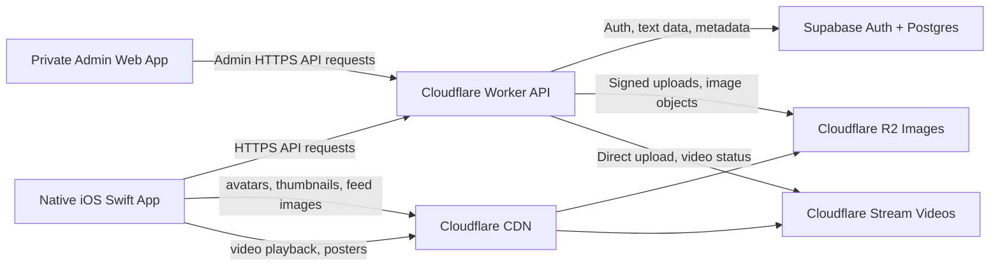

# Captro Architecture Blueprint

Captro is a native iOS social media app for photo posts, short videos, profiles, chat, Discover, stories, reporting, and moderation. This document defines the target production architecture using Supabase for authentication and structured data, Cloudflare for API, media storage, media delivery, and private admin tooling, and the native Swift app as the user-facing client.

Current production infrastructure still uses Flames-up naming in places:

- Production API: `https://api.flames-up.com/api`
- Worker name: `flames-up-api`
- Current admin web deployment: `captro-admin.pages.dev`

Final branded Captro domains should be:

- API: `https://api.captro.app`
- Media: `https://media.captro.app`
- Admin: `https://admin.captro.app`

## 1. High-Level Diagram

Request flow:

1. iOS app and admin web call the Cloudflare Worker API.
2. Worker verifies auth, validates input, enforces permissions, and rate-limits sensitive actions.
3. Worker reads/writes structured data in Supabase.
4. Worker signs or creates media uploads for R2 and Stream.
5. Media is delivered through Cloudflare CDN using optimized URLs.

Architecture principle:

- Do not store large image or video binaries in the database.
- Supabase stores auth, relational data, metadata, moderation data, and audit logs.
- Cloudflare R2 stores image objects and image variants.
- Cloudflare Stream stores, processes, and delivers video.
- Cloudflare Worker is the secure backend layer between clients, Supabase, and Cloudflare media services.

## 2. Supabase Responsibilities

Supabase handles structured data and account identity:

- Authentication
- Profiles
- Usernames and normalized username uniqueness
- Post captions
- Post metadata
- Likes
- Comments and replies
- Saves and save collections
- Follows, friends, and social graph metadata
- Chat metadata and messages if chat remains in Supabase
- Reports
- Blocks
- Notification metadata
- Admin roles
- Moderation actions
- Audit logs

Rules:

- Enable Row Level Security where direct Supabase access exists.
- Treat the Cloudflare Worker as the main trusted API boundary.
- The Worker must still enforce backend permission checks even when RLS exists.
- Do not store image/video binaries in Postgres.
- Store media metadata only: URLs, object keys, Stream UIDs, dimensions, aspect ratio, duration, processing status, and poster/thumbnail references.

## 3. Cloudflare R2 Responsibilities

R2 handles image object storage:

- User avatars
- Uploaded photos
- Optimized 1080x1440 feed images
- Profile thumbnails
- Discover thumbnails
- Temporary upload files if needed

Image media versions:

- `original`: preserved original image for moderation, future exports, or future processing.
- `feed`: optimized 1080x1440 image for the main feed.
- `thumbnail`: small grid thumbnail for profile and Discover.
- `avatarThumbnail`: compact avatar variant.
- `placeholder`: optional blur hash, dominant color, or tiny preview metadata.

R2 rules:

- R2 object keys should not expose secrets or internal database IDs unnecessarily.
- Original media should not be returned in feed payloads.
- Public media can be served through `media.captro.app` with long cache headers.
- Private or restricted media should use signed URLs or Worker-mediated access.
- Media deletion or moderation removal should update metadata in Supabase and purge CDN cache when necessary.

## 4. Cloudflare Stream Responsibilities

Cloudflare Stream handles video:

- Short video uploads
- Video storage
- Video encoding
- Adaptive playback
- Poster thumbnails
- Video delivery

Video upload flow:

1. iOS requests a video upload session from the Worker.
2. Worker validates auth, file intent, duration limits, and user permissions.
3. Worker creates a Cloudflare Stream direct upload.
4. iOS uploads video directly to Stream.
5. Stream processes and encodes the video.
6. Worker receives status by webhook or polling.
7. Supabase stores Stream UID, playback URL, poster URL, duration, dimensions, aspect ratio, and processing status.
8. Feed/Discover/Profile APIs expose only the playback/poster fields needed by the screen.

Video rules:

- Do not fake video delivery with raw large files in the feed.
- Do not store video binaries in Supabase.
- Do not autoplay every video at once.
- Use poster thumbnails before playback.
- Use adaptive playback URLs from Stream where possible.

## 5. Cloudflare CDN Responsibilities

Cloudflare CDN handles fast global delivery of:

- Avatars
- Profile thumbnails
- Discover thumbnails
- Feed images
- Stream video playback assets
- Static admin web assets

Target custom domains:

- `api.captro.app` for the Worker API.
- `media.captro.app` for R2 media.
- `admin.captro.app` for the admin web app.

Current deployed names:

- API currently uses `https://api.flames-up.com/api`.
- Worker is currently deployed as `flames-up-api`.
- Admin web currently uses Cloudflare Pages under Captro admin naming.

CDN rules:

- Immutable image variants should use long cache headers.
- Use versioned object keys for media replacements instead of mutating old objects.
- Purge cache when content is removed for moderation.
- Do not cache authenticated API responses unless explicitly safe.

## 6. Cloudflare Worker API Responsibilities

The Worker is the secure backend layer. It handles:

- Auth verification
- Permission checks
- API routes
- Upload URL creation and signing
- R2 integration
- Stream direct upload integration
- Post creation
- Feed, Discover, and Profile APIs
- Comments, likes, saves, follows, and blocks
- Reports and moderation routing
- Admin/moderation endpoints
- Rate limiting
- Response shaping
- Safe caching headers
- Request IDs and safe logs

The Worker must not expose:

- Supabase service role key
- Cloudflare API token
- R2 secret
- Stream API token
- Admin secrets
- Database credentials
- Private message content outside authorized contexts

Worker rules:

- Never trust client-side permissions.
- Validate every request body and query parameter.
- Enforce object-level authorization for every content ID.
- Rate-limit auth, posting, commenting, messaging, reporting, upload, and admin write actions.
- Return small, screen-specific payloads.
- Use structured error responses without leaking stack traces.
- Keep secrets in Worker environment secrets only.

## 7. Database Schema Overview

Core tables:

- `profiles`: user profile, display name, username, avatar metadata, bio, privacy settings.
- `posts`: post owner, caption, category, location metadata, visibility, status, counts, created timestamp.
- `post_media`: post ID, media type, R2 object keys, Stream UID, feed URL, thumbnail/poster URL, width, height, aspect ratio, duration, processing status.
- `likes`: post ID, user ID, created timestamp, unique `(post_id, user_id)`.
- `comments`: post ID, user ID, parent comment ID, body, status, pinned state, counts, created timestamp.
- `saves`: post ID, user ID, collection name, created timestamp, unique `(post_id, user_id, collection)`.
- `follows`: follower ID, following ID, status, created timestamp, unique pair.
- `blocks`: blocker ID, blocked ID, created timestamp, unique pair.
- `reports`: reporter ID, target type, target ID, target owner ID, reason, details, priority, status, reviewed by, timestamps.
- `notifications`: user ID, type, metadata, read state, created timestamp.
- `conversations`: direct/group conversation metadata, last message preview, timestamps.
- `conversation_members`: conversation ID, user ID, role, joined timestamp, read state.
- `messages`: conversation ID, sender ID, body/media metadata, status, timestamps.
- `admin_roles`: user ID, role, created by, timestamps.
- `moderation_actions`: admin ID, action type, target type, target ID, reason, note, timestamp.
- `audit_logs`: actor admin ID, role, action, target, before/after state, request ID, safe request metadata, timestamp.

Indexes should support:

- Feed by `created_at`.
- Profile posts by `user_id, created_at`.
- Discover by `category, created_at`.
- Comments by `post_id, created_at`.
- Likes by `post_id, user_id`.
- Saves by `post_id, user_id`.
- Follows by follower/following.
- Blocks by blocker/blocked.
- Messages by `conversation_id, created_at`.
- Notifications by `user_id, created_at`.
- Reports by `status, priority, created_at`.

## 8. Media Upload Flows

### Photo Upload

1. iOS requests a photo upload from the Worker.
2. Worker validates auth, account status, media limits, MIME type, and upload intent.
3. iOS uploads original image to R2 using a signed upload flow.
4. Worker or media processing pipeline creates:
   - original image reference
   - 1080x1440 feed image
   - profile/Discover thumbnail
   - optional avatar thumbnail
   - optional placeholder metadata
5. Worker saves media URLs/object keys and metadata in Supabase.
6. Worker publishes the post only when required media metadata is stable enough for the feed.

### Video Upload

1. iOS requests a video upload from the Worker.
2. Worker validates auth, account status, video duration, file size, and upload intent.
3. Worker creates a Cloudflare Stream direct upload.
4. iOS uploads video directly to Stream.
5. Stream encodes and processes the video.
6. Worker updates Supabase with Stream UID, playback URL, poster URL, dimensions, duration, and status.
7. Post becomes visible when video metadata/poster is available, or a stable processing state exists.

## 9. Feed API Design

Feed responses should include only lightweight fields:

- Post ID
- Author ID
- Username
- Display name
- Avatar thumbnail
- Caption
- Category
- Created timestamp
- Feed media URL
- Thumbnail or poster URL
- Media width
- Media height
- Media aspect ratio
- Like count
- Comment count
- Save count
- Viewer liked state
- Viewer saved state
- Viewer following state if needed

Feed responses must not return:

- Base64 media
- Original full-size media
- Full comments
- Full profile records
- Private user data
- Admin data
- Internal storage credentials

Feed rules:

- Default feed image/video preview uses 3:4 media, 1080x1440 target.
- Media containers reserve size before media loads.
- First visible posts load first.
- Nearby media may preload lightly.
- Opening comments, save, share, report, or options must not reload the whole feed.

## 10. Security Rules

Core rules:

- Backend checks every sensitive action.
- No frontend-only permissions.
- iOS stores auth tokens in Keychain, not UserDefaults.
- Supabase RLS is enabled where direct Supabase access exists.
- Worker enforces permissions even when RLS is enabled.
- Rate-limit auth, signup, username checks, posts, comments, messages, reports, likes, saves, follows, and uploads.
- Validate media type, size, and video duration.
- Protect admin web with backend role checks and optionally Cloudflare Access.
- Audit-log all admin actions.
- No secrets in iOS or admin frontend.
- No Cloudflare API tokens in client code.
- No Supabase service role key in client code.
- No private message exposure outside authorized users or audited reported-message review.

Admin/security rules:

- Admin endpoints require authentication and role-based authorization.
- Non-admin users receive access denied.
- Destructive moderation actions require confirmation, reason, and audit logging.
- Reported users must not see reporter identity.
- Reported messages show limited context only when admin role permits it.

## 11. Performance Rules

Media performance:

- Feed uses optimized 1080x1440 media.
- Profile and Discover grids use thumbnails.
- Video uses poster thumbnails before playback.
- Original media is not loaded directly in the feed.
- CDN caches immutable media aggressively.

App performance:

- iOS caches feed, Discover, Profile, and chat previews.
- Use skeleton placeholders when fresh data is not ready.
- Reserve media height before image/video loads.
- Avoid layout jumps.
- Avoid duplicate API calls for the same screen state.
- Keep scroll position stable after likes, comments, saves, reports, and tab switching.
- Do not create too many video player instances.

API performance:

- Use pagination for feed, Discover, profile posts, comments, messages, notifications, reports, and admin tables.
- Return screen-specific fields only.
- Avoid returning full comments inside feed responses.
- Use indexes for hot queries.

## 12. Admin/Moderation Architecture

Admin web app:

- Private access only.
- Uses production API.
- Loads no moderation data before auth and role checks complete.
- Reviews reports.
- Reviews reported messages with limited context.
- Removes/hides and restores content.
- Warns, restricts, suspends, and bans users.
- Handles blocks and platform restrictions.
- Writes audit logs for every admin action.

Worker admin endpoints:

- Authenticate every request.
- Check admin/moderator role server-side.
- Validate body fields.
- Rate-limit destructive actions.
- Return safe errors.
- Never expose admin secrets to the frontend.

Recommended extra layer:

- Protect `admin.captro.app` with Cloudflare Access.
- Allow only approved admin emails.
- Keep backend role checks even when Cloudflare Access is enabled.

## 13. MVP Architecture

Keep the production MVP simple:

- Native iOS Swift app.
- Cloudflare Worker API.
- Supabase Auth and Postgres.
- Cloudflare R2 for images.
- Cloudflare Stream for videos.
- Cloudflare CDN delivery.
- Private admin web app.

Avoid for MVP:

- Custom video encoding server.
- Complex AI recommendation system.
- Microservices.
- Kubernetes.
- Expensive infrastructure that is not needed for current scale.
- Direct database access from public clients for sensitive actions.

## 14. Acceptance Criteria

The architecture is correct when:

- Supabase stores auth, text, relational data, and metadata.
- R2 stores image files and image variants.
- Stream handles video upload, processing, and playback.
- CDN delivers media quickly.
- Worker protects all backend actions.
- Worker signs upload flows and shapes API responses.
- iOS app does not contain backend secrets.
- Admin web app does not contain backend secrets.
- Feed payloads are small and screen-specific.
- Media loads fast through optimized URLs.
- Original media is preserved but not served in normal feed responses.
- Admin moderation works through protected Worker endpoints.
- Reports, blocks, audit logs, and admin roles are represented in the data model.
- Security scans remain green.
