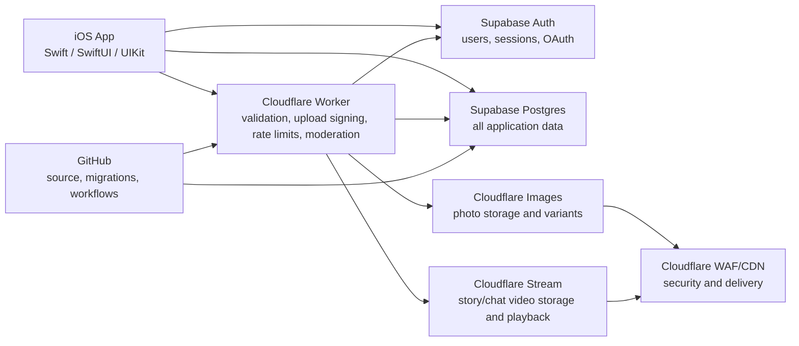

# Captro Final Backend Architecture

Last updated: 2026-06-15

## Target Architecture

## Source Of Truth

Supabase is the only source of truth for:

- Auth, sessions, provider identities, and account state
- Profiles/users
- Posts and post media metadata
- Likes, saves/bookmarks, comments, follows, blocks
- Stories, story likes/views/thoughts
- Conversations, messages, group chats
- Notifications and push tokens
- Reports, moderation jobs/results/actions, admin roles, audit logs
- Account deletion and safety records

Cloudflare is only used for:

- Cloudflare Workers API layer
- Cloudflare Images photo upload/storage/variants
- Cloudflare Stream video upload/processing/playback
- WAF/CDN/security headers
- Request validation and rate limiting
- Media moderation pipeline
- Optional temporary rate-limit/cache KV

Cloudflare D1 must not be used for production application records.

## Changes In This Pass

- Social login endpoints now use Supabase Auth as the first validator for Google and Apple ID tokens.
- Google login request now accepts `access_token` from iOS and forwards it to Supabase Auth when available.
- Apple login now sends a raw nonce from iOS so Supabase can validate native Apple sign-in securely.
- iOS Google config now supports `GIDServerClientID` through the `GOOGLE_SERVER_CLIENT_ID` build setting.
- Auth docs now call out the required Google Web OAuth client ID for Supabase-native social login.
- Repository docs now state that Supabase is the production database and Cloudflare D1 is not a source of truth.

## Required Production Configuration

Supabase:

- Google provider enabled with the Captro Web OAuth client ID and secret.
- Apple provider enabled with the Captro Services ID and Apple credentials where needed.
- RLS enabled on every public application table.
- Migrations applied from `supabase/migrations` through GitHub Actions, not Table Editor.

iOS/TestFlight:

- `PRODUCT_BUNDLE_IDENTIFIER = com.captro.app`
- `GIDClientID` remains the iOS OAuth client ID.
- `GOOGLE_SERVER_CLIENT_ID` must be set to the Web OAuth client ID used by Supabase.
- Sign in with Apple capability enabled on the App ID.

Cloudflare Worker:

- `DATABASE_PRIMARY=supabase_postgres`
- `SUPABASE_URL` as a Worker variable.
- `SUPABASE_SERVICE_ROLE_KEY` as a Worker secret only.
- No service-role key in iOS or admin web bundles.

## Migration Workflow

1. Create database changes as SQL migrations under `supabase/migrations`.
2. Commit migration files, RLS policies, functions, triggers, and docs to GitHub.
3. Run the `Supabase Postgres Migrations` GitHub workflow.
4. Use the confirmation input `MIGRATE_SUPABASE_PRODUCTION`.
5. Verify migration status, RLS, indexes, and app smoke tests.
6. Deploy the Worker after migrations are applied.

## Remaining D1 Removal Work

The Worker still contains legacy D1 helper code and a `DB` binding. Production is configured with `DATABASE_PRIMARY=supabase_postgres`, and many routes already fail closed if Supabase primary is not configured.

Current audit:

- `backend-cf/src/index.ts` has 266 `c.env.DB` references.
- `backend-cf/src/index.ts` has 47 `D1Database` type references.
- `backend-cf/wrangler.toml` still binds `DB` for development and production.

The safe removal plan is:

1. Audit each remaining `c.env.DB` path.
2. Delete D1-only schema/bootstrap functions after the matching Supabase route is verified.
3. Remove legacy D1 migrations and reset scripts.
4. Remove the `DB` binding from `wrangler.toml`.
5. Run Worker typecheck and production smoke tests.

Do not remove the D1 binding before step 2 is complete, because any un-migrated cold path would become a runtime crash instead of a controlled Supabase-primary failure.

## Security Improvements

- Supabase Auth validates Google/Apple provider tokens before the Worker issues a session response.
- Worker continues to verify Supabase JWTs for protected upload/admin/action endpoints.
- OAuth provider metadata is derived from Supabase session/user identities after Supabase validation.
- Service-role usage remains server-side only in the Worker.
- Social login no longer depends on Cloudflare D1 user lookup before Supabase Auth succeeds.

## Performance Improvements

- Social login avoids a required Google tokeninfo network call before Supabase Auth validation.
- The Worker still preserves optional profile enrichment from Supabase session metadata.
- GitHub-tracked migrations reduce production drift and make schema deploys reproducible.

## Production Readiness Status

Ready:

- Migration-first Supabase workflow exists.
- Supabase RLS/schema documentation exists.
- Worker typecheck passes after the social auth fix.
- Moderation tests pass after the social auth fix.

Not yet complete:

- D1 legacy code and binding still exist.
- Full Supabase-only post creation path still needs final verification.
- iOS release build/TestFlight validation must run in GitHub Actions/Xcode.
- `GOOGLE_SERVER_CLIENT_ID` must be configured in CI/build settings before Google sign-in can be fully validated on device.
