# Captro Supabase ERD

This is the production database relationship map for Captro's Supabase/Postgres data layer. It is intentionally focused on canonical app tables; legacy compatibility tables are omitted unless they still matter during migration.

```mermaid
erDiagram
  AUTH_USERS ||--o| APP_USERS : "supabase_user_id"
  AUTH_USERS ||--o{ APP_POSTS : "user_id"
  AUTH_USERS ||--o{ APP_POST_INTERACTIONS : "user_id"
  AUTH_USERS ||--o{ POST_COMMENTS : "user_id"

  APP_USERS ||--o{ APP_POSTS : "app_user_id"
  APP_USERS ||--o{ APP_MEDIA_ASSETS : "user_id"
  APP_USERS ||--o{ APP_POST_INTERACTIONS : "app_user_id"
  APP_USERS ||--o{ POST_COMMENTS : "app_user_id"
  APP_USERS ||--o{ APP_FOLLOWS : "follower"
  APP_USERS ||--o{ APP_FOLLOWS : "following"
  APP_USERS ||--o{ APP_BLOCKS : "blocker"
  APP_USERS ||--o{ APP_BLOCKS : "blocked"
  APP_USERS ||--o{ APP_STORIES : "user_id"
  APP_USERS ||--o{ APP_REPORTS : "reporter/target_owner"
  APP_USERS ||--o{ APP_NOTIFICATIONS : "recipient"
  APP_USERS ||--o{ APP_MESSAGES : "sender"
  APP_USERS ||--o{ APP_MESSAGES : "receiver"
  APP_USERS ||--o{ APP_GROUP_CHAT_MEMBERS : "member"
  APP_USERS ||--o{ APP_GROUP_MESSAGES : "sender"
  APP_USERS ||--o{ APP_ADMIN_ROLES : "admin_user"

  APP_POSTS ||--o{ APP_MEDIA_ASSETS : "post media"
  APP_POSTS ||--o{ POST_COMMENTS : "comments"
  APP_POSTS ||--o{ APP_POST_INTERACTIONS : "likes/saves"
  APP_POSTS ||--o| APP_POST_PLACES : "place tag"

  POST_COMMENTS ||--o{ POST_COMMENTS : "replies"
  POST_COMMENTS ||--o{ POST_COMMENT_LIKES : "comment likes"

  APP_STORIES ||--o{ APP_STORY_LIKES : "likes"
  APP_STORIES ||--o{ APP_STORY_VIEWS : "views"
  APP_STORIES ||--o{ APP_STORY_THOUGHTS : "thoughts"

  APP_GROUP_CHATS ||--o{ APP_GROUP_CHAT_MEMBERS : "members"
  APP_GROUP_CHATS ||--o{ APP_GROUP_MESSAGES : "messages"

  APP_MEDIA_ASSETS ||--o{ APP_MODERATION_JOBS : "moderation jobs"
  APP_MEDIA_ASSETS ||--o{ APP_MODERATION_RESULTS : "moderation results"
  APP_MEDIA_ASSETS ||--o{ APP_MODERATION_EVENTS : "moderation events"

  APP_ADMIN_ROLES ||--o{ APP_AUDIT_LOGS : "admin actions"
  APP_ADMIN_ROLES ||--o{ APP_MODERATION_ACTIONS : "moderation actions"
```

## Notes

- `AUTH_USERS` represents Supabase Auth's `auth.users`.
- `APP_USERS` is Captro's canonical app profile/account table.
- `APP_POST_INTERACTIONS` is the canonical likes/saves/bookmarks/reposts table.
- `APP_MEDIA_ASSETS` stores media metadata and Cloudflare identifiers/URLs only.
- Admin and moderation access must be enforced by backend role checks and RLS policies.
- D1-era tables and migrations are legacy compatibility artifacts, not the production database model.
